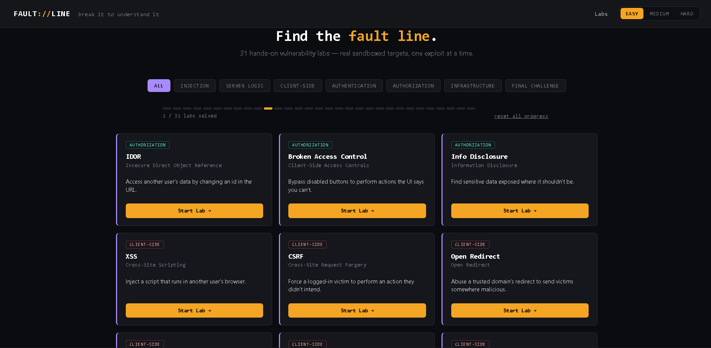

# Faultline



36 hands-on, intentionally vulnerable web security training labs — real
sandboxed target applications, one exploit at a time. Log in on the actual
vulnerable page, edit the URL/form/header as instructed, and watch the
exploit happen live — just like a real pentest lab.

> ⚠️ **This application is deliberately insecure by design.** Every bug is
> intentional and exists to teach. Run it only on `localhost` or an isolated
> sandbox/VM. Risky-sounding techniques (file reads, "command execution",
> SSRF) are all simulated against fake in-memory data — see
> `routes/vuln-common.js` — so nothing here touches your real filesystem or
> makes real outbound network requests. Still: never deploy this publicly,
> and never reuse this code in a real product.

## What's included

**All 36 labs are fully working**, each with a real standalone vulnerable
page (opened in a new tab), plus Goal / Lab / Exploit / Report tabs, a
global Easy/Medium/Hard difficulty toggle that changes real server-side
behavior, and a **Reset this lab** button so you can wipe a lab's demo data
and solved status to practice again from scratch.

**Every difficulty tier requires a genuinely different technique.** This
was audited end-to-end: the exact payload that solves a lab on Easy is
verified to fail on Medium and Hard, and Medium's technique is verified to
fail on Hard. A few examples: XSS's medium filter blocks the easy
`<script>` payload, requiring an event-handler payload instead; hard blocks
that too, requiring `autofocus`+`onfocus`. Cache Poisoning's vulnerable
parameter is different per tier (`utm_source` → `ref` → `lang`) since each
"fix" only patched the last one found. Prototype Pollution's medium
denylist blocks `__proto__` but not `constructor`/`prototype` (still
reachable); hard blocks all three and is honestly reported as **not
exploitable** — a genuinely complete fix, not a fake bypass. Subdomain
Takeover uses a different dangling subdomain per tier so easy's answer
doesn't carry over. One caveat: a handful of labs (Client-Side Template
Injection, postMessage's origin-check gap) have a core mechanic that's
identical by nature across tiers — those are called out explicitly in
their Goal tab rather than pretending otherwise.

**Real flag-based verification.** The Report tab doesn't accept any
payload-shaped guess. Each session gets a unique, server-issued flag per
lab+difficulty (`FLAG{lab-difficulty-random}`), only revealed in the
response when the exploit genuinely succeeds. Submitting that exact flag is
what marks a lab solved — guessing, replaying an old flag after a reset, or
reusing another session's flag all correctly fail.

**Per-severity reports.** The Report tab's Summary, Reproduction Steps, and
Impact are genuinely different for Easy/Medium/Hard, matching whichever
technique that tier actually requires.

**Search and appearance.** A search box on the homepage filters labs by
name/description/category. A 🌙/☀️/🖥 toggle in the header switches between
dark, light, and system-matched appearance, saved across visits.

| Category | Labs |
|---|---|
| Injection | SQL Injection (real SQLite via sql.js), Command Injection, SSTI, XXE, CRLF Injection |
| Server-Side Logic | SSRF, Insecure File Upload, Path Traversal, LFI, Cache Poisoning, Cache Deception, Request Smuggling, Secondary Context, Race Conditions |
| Client-Side | XSS, CSRF, Open Redirect, Client-Side Template Injection, postMessage, Prototype Pollution |
| Authentication | 2FA Bypass, Weak Password Checks, Brute Force Attack, Password Reset Issues, OAuth Misconfiguration, SAML Vulnerabilities |
| Authorization | IDOR, Broken Access Control, Information Disclosure |
| Infrastructure | Cloud Storage Misconfiguration, Subdomain Takeover |
| Web Enumeration | Files & Directories, Virtual Host Enumeration, Fuzzing & HTTP Parameters, DNS Zone Transfer |
| Final | Chained challenge (Access Control → IDOR) |

## The "Open Lab" pattern

Every lab's **Lab** tab opens a real standalone target app in a new tab —
its own page, its own login/"Generate Credentials" step where relevant, and
a real URL you can edit directly in the address bar (e.g.
`/vuln/idor/profile?id=3` → change `3` to `1`). This matches how the actual
vulnerable apps behave, rather than a simulated console.

## Setup & run

Requires Node.js 18+.

```bash
cd faultline-labs
npm install
npm start
```

Then open **http://localhost:3000** in a desktop browser (no mobile layout
by design).

- **Lab progress** lives in the browser's `localStorage`. Use **reset all
  progress** on the homepage, or **↺ Reset this lab** on any lab page.
- **Server-side demo state** (sessions, notes, gift card balances, etc.)
  lives in memory and resets when you restart the server, or immediately
  for a single lab via its Reset button.

## How difficulty really works

Difficulty changes real server logic in the `routes/` files — a few
highlights:

- **SQL Injection** — login is vulnerable at easy/medium; at hard the login
  is fully parameterized and safe, but a separate department-search field
  is always vulnerable to UNION-based injection.
- **Path Traversal / LFI** — easy has no filtering; medium strips `../`
  once (bypassed with `....//`); hard strips it recursively but is bypassed
  by double URL-encoding, since a later step decodes twice.
- **XSS** — escalating denylist (`<script` → also `onerror=`/`onload=`),
  always leaving a real bypass (`onfocus` + `autofocus`) at hard.
- **CSRF** — no protection → shallow `Origin` check → a `Sec-Fetch-Mode`
  check that blocks img/fetch but allows a real top-level link click,
  mirroring how `SameSite=Lax` actually works.
- **SSRF** — literal internal addresses → blocked, bypassed via hex/decimal
  IP encoding → blocked, bypassed by chaining through a "trusted" redirector.
- **Race Conditions** — a genuine check-then-act gap; fire enough concurrent
  requests (the UI suggests how many) to double-spend a gift card balance.
- **Prototype Pollution** — no denylist → blocks `__proto__` specifically
  (bypassed via `constructor.prototype`, which reaches the same object) →
  blocks all three dangerous keys (genuinely not exploitable — a real fix).
- **Brute Force** — username enumeration via distinct error messages →
  response-timing difference → an account-lockout side channel that only
  triggers for valid usernames.

Full details for every lab are in its Goal/Exploit tabs in the app.

## Project structure

```
faultline-labs/
├── server.js                    # Express entrypoint, mounts every route module
├── routes/
│   ├── vuln-common.js           # Shared session store, fake VFS, fake internal services, page shell, flag system
│   ├── vulns-authz.js           # IDOR, Broken Access Control, Final Challenge
│   ├── vulns-clientside.js      # XSS, CSRF, Open Redirect, CSTI, postMessage, Prototype Pollution
│   ├── vulns-injection.js       # SQLi, Command Injection, SSTI, XXE, CRLF
│   ├── vulns-serverlogic.js     # SSRF, File Upload, Path Traversal, LFI, Cache Poisoning/Deception,
│   │                             Request Smuggling, Secondary Context, Race Conditions
│   ├── vulns-auth.js            # 2FA Bypass, Weak Password, Brute Force, Password Reset, OAuth, SAML
│   ├── vulns-infra.js           # Info Disclosure, Cloud Storage Misconfig, Subdomain Takeover
│   ├── vulns-enum.js            # Files & Directories, Virtual Hosts, Fuzzing & Parameters, DNS Zone Transfer
│   └── reset-and-validate.js    # POST /api/reset-lab, POST /api/validate-lab (real flag verification)
├── public/
│   ├── index.html / lab.html
│   ├── css/style.css
│   └── js/{labs-data.js, app.js, lab.js, theme.js}
└── README.md
```

## Disclaimer

For legal, hands-on security education only. Do not use any technique
learned here against systems you don't own or have explicit written
permission to test.
